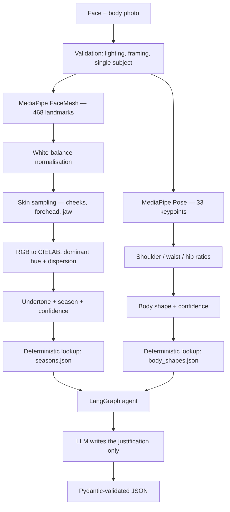

# flair-ai-style-matcher
 **Find yours.**

Flair analyses two photos — a face and a full body — to determine your **color season** and **body shape**, then generates a personal color palette and styling recommendations grounded in both measurements.

Built for a market that existing tools serve poorly: the app is calibrated with MENA and olive skin tones as a first-class concern, not an afterthought.


> **Status — Week 0 of 7.** The architecture and reference data model are defined; implementation is in progress. Sections marked _pending_ will be filled in as modules land. Nothing below is claimed as working until it is.

---

## What it does

| Input | Output |
|---|---|
| Face photo | Undertone (warm / cool / neutral), season, depth, **confidence score** |
| Full-body photo | Body shape across 5 categories, shoulder–hip and waist–hip ratios, **confidence score** |
| Both, plus occasion | A palette of 8–10 colors, colors to avoid, and cut / fabric / pattern recommendations with reasoning |

---

## How it works



Three layers, one backend:

1. **Computer vision (Python)** — extracts objective measurements. No LLM involved.
2. **Knowledge + agent (LangGraph)** — factual data comes from versioned JSON; the LLM only writes prose around it.
3. **Presentation (Next.js)** — palette swatches, style cards, confidence indicator, correction loop.

---

## Design decisions

The interesting part of this project is what it deliberately does *not* do.

**The LLM never produces facts.** Hex codes come from a versioned `seasons.json`; cut rules come from `body_shapes.json`. The model receives those values in its prompt and writes only the *"why this works for you"* explanation. Ask a language model for "the Deep Winter palette" and it will return plausible, confidently wrong hex codes. A deterministic palette is also testable by equality — a generated one is not testable at all.

**Four seasons at MVP, not twelve.** The 12-season system separates on three axes: undertone, value, and chroma. Value and chroma require reliable absolute luminance, which a phone destroys through auto white-balance and auto-exposure before the file even exists. Shipping 12 seasons on that input produces output that looks precise and changes when the user retakes the photo near a window. Twelve seasons is a V1.1 goal, gated on golden-set validation.

**Confidence scores over false certainty.** Every analysis returns a confidence value derived from sample dispersion and classification margin. Below threshold, the UI says so instead of asserting a result. Under every result: *"Does this match you?"* — and each correction becomes a labelled data point.

**No photo ever reaches an LLM provider.** All computer vision runs server-side. Only numeric results — undertone, ratios — are sent to the model. Face and body photos are processed in memory and discarded with the response; they are never written to disk.

**White-balance normalisation before any sampling.** Gray-world correction runs on the face region before a single skin pixel is read. This is the single highest-leverage accuracy fix in the pipeline.

---

## Tech stack

| Layer | Choice | Why |
|---|---|---|
| Backend | Python 3.11 + FastAPI | MediaPipe and LangGraph are Python-native; a polyglot split would add a bridge with no benefit |
| Computer vision | MediaPipe + `opencv-python-headless` | Pre-trained models, no custom training required |
| Color math | scikit-image (CIELAB, CIEDE2000) | Maintained and numpy-compatible — `colormath` is unmaintained and breaks on numpy ≥ 1.24 |
| Agent | LangGraph | Explicit state graph over the recommendation flow |
| LLM | Groq — `gpt-oss-120b` | Open-weight, free tier, ~320 tok/s |
| Vision LLM (V1.1) | Google Gemini Flash | Only strong free tier with native image input |
| Frontend | Next.js + TypeScript + Tailwind | — |
| Hosting | Hugging Face Spaces + Vercel | Free tiers with enough RAM for MediaPipe — see note below |

**Running cost: $0/month.** Free-tier infrastructure, pre-trained models, free-tier LLMs.

> **A deployment note worth recording:** Render and Railway free tiers cap at 512 MB RAM. MediaPipe and OpenCV together exceed that before the first model loads — the container simply will not start. Hugging Face Spaces provides 16 GB, and is a natural home for a CV demo.

---

## Getting started

```bash
git clone https://github.com/<your-username>/flair.git
cd flair
```

**Backend**

```bash
cd backend
python -m venv .venv
.venv\Scripts\activate          # Windows
# source .venv/bin/activate     # macOS / Linux
pip install -r requirements.txt
cp .env.example .env            # then add your Groq API key
uvicorn app.main:app --reload   # http://localhost:8000
```

**Frontend**

```bash
cd frontend
npm install
npm run dev                     # http://localhost:3000
```

Get a free Groq API key at [console.groq.com](https://console.groq.com) — no credit card required.

---

## Accuracy

Both classifiers are threshold rules, not trained models. Accuracy is measured against a golden set of ~20 hand-labelled photos, deliberately diverse in skin tone and lighting conditions.

```bash
cd backend && pytest tests/test_golden_set.py -v
```

| Metric | Result |
|---|---|
| Season agreement | _pending_ |
| Body shape agreement | _pending_ |

Numbers will be published here once the golden set is complete — including the ones that aren't flattering.

---

## Roadmap

**MVP (7 weeks)**
- [ ] Week 0 — Vertical slice: upload → FaceMesh → dominant color rendered
- [ ] Week 1 — Skin sampling, gray-world correction, CIELAB conversion
- [ ] Week 2 — Undertone + 4-season classification, golden set
- [ ] Week 3 — Pose detection, ratios, 5 body shapes
- [ ] Week 4 — Reference data files + LangGraph agent
- [ ] Week 5 — Frontend, error states
- [ ] Week 6 — Deployment, user testing
- [ ] Week 7 — Documentation, demo video

**V1.1** — Accounts and persistence · 12 seasons · virtual closet with outfit generation · RAG over style guides

**V2** — Dedicated MENA / olive skin tone calibration · local Tunisian retailer suggestions

---

## Known limitations

Stated plainly, because a tool that analyses people's bodies should be honest about what it can't do.

- **Single-photo body analysis is approximate.** Clothing volume, camera angle, and distance all shift the measured ratios. Hence the confidence score and the manual correction step.
- **Uncalibrated color is the hard ceiling.** Without a reference card in frame, absolute color accuracy is bounded. Gray-world correction reduces the error; it does not eliminate it.
- **Pre-trained models carry inherited bias.** MediaPipe's landmark detection is less accurate on skin tones and body types underrepresented in its training data. Documenting this is the honest minimum; correcting it for MENA skin tones is what V2 is for.
- **Results are stylistic guidance.** Not a physical assessment, and not a standard to meet.

---

## Privacy

- Face and body photos are processed in memory and discarded with the response. They are never written to disk.
- No image is transmitted to any third-party model provider. Only numeric analysis results leave the server.
- HTTPS in transit. No third-party sharing.

---

## License

MIT — see [LICENSE](LICENSE).
